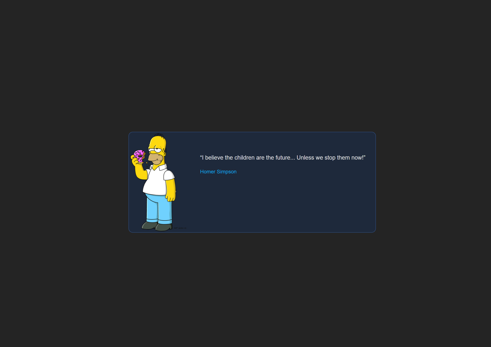
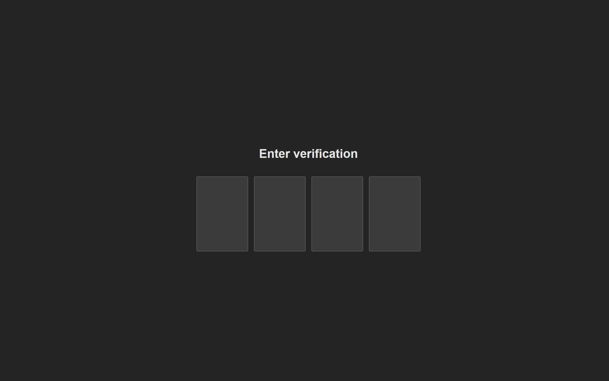

# Titansoft Quiz

Using node 20.x version

1. install dependencies

```bash
pnpm i
```

2. run frontend server

```bash
pnpm run dev
```

3. run backend server

```bash
pnpm run server
```

---

## Page Design

1. Profile Page
   
2. Otp Page
   

## Requirement

1. if user not authenticated, should redirect to verification page
2. if user authenticated, should redirect to profile page

## Verification Page

- [ ] should have 4 digit inputs
- [ ] should focus on first input when page loaded
- [ ] should focus on next input when user enter a digit
- [ ] should focus on previous input when user press backspace
- [ ] should auto submit when user enter 4 digits
- [ ] should show error message when user enter wrong code
- [ ] should show loading when user submit code
- [ ] should redirect to profile page when user submit correct code
- [ ] able to paste code from clipboard
- [ ] input should be numeric only
- [ ] each input should be 1 numeric only

## Profile Page

- [ ] should show username, quote, user photo and logout button
- [ ] should remove token and redirect to verification page when user click logout button
- [ ] should not log out user when user refresh page

## Mock API Documentation

### Overview

This document provides detailed specifications and usage guidelines for the `/api/verify` and `/api/auth` endpoints.

---

### 1. Verification API - POST /api/verify

#### Request Body:

| Parameter | Type   | Description            |
| --------- | ------ | ---------------------- |
| code      | string | The verification code. |

#### Example Request:

```json
{
  "code": "12345"
}
```

#### Response:

Returns whether the verification code is valid. If valid, a token is also provided.

#### Example Response (valid code):

```json
{
  "valid": true,
  "token": "example_token"
}
```

#### Example Response (invalid code):

```json
{
  "valid": false
}
```

### 2. Authorization API - GET /api/auth

#### Request Headers:

| Header Name   | Value  | Description                         |
| ------------- | ------ | ----------------------------------- |
| Authorization | string | The token received from /api/verify |

#### Response:

If authorized, the response will contain the username,quote and photo. Otherwise, an error message will be provided.
If valid, a token is also provided.

#### Example Response (Authorized):

When valid:

```json
{
  "username": "johnDoe",
  "quote": "Hello, World!",
  "photo": "https://example.com/image.jpg"
}
```

#### Example Response (Unauthorized):

```json
{
  "message": "unauthorized"
}
```
